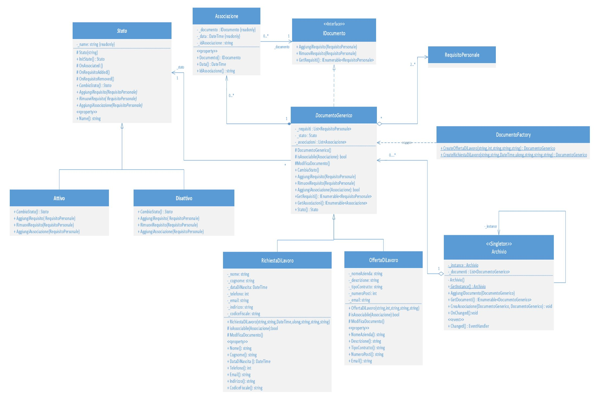
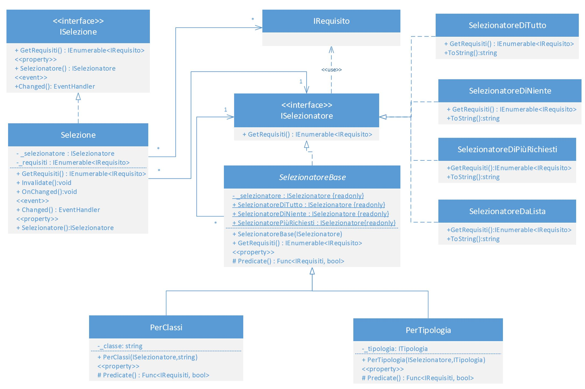
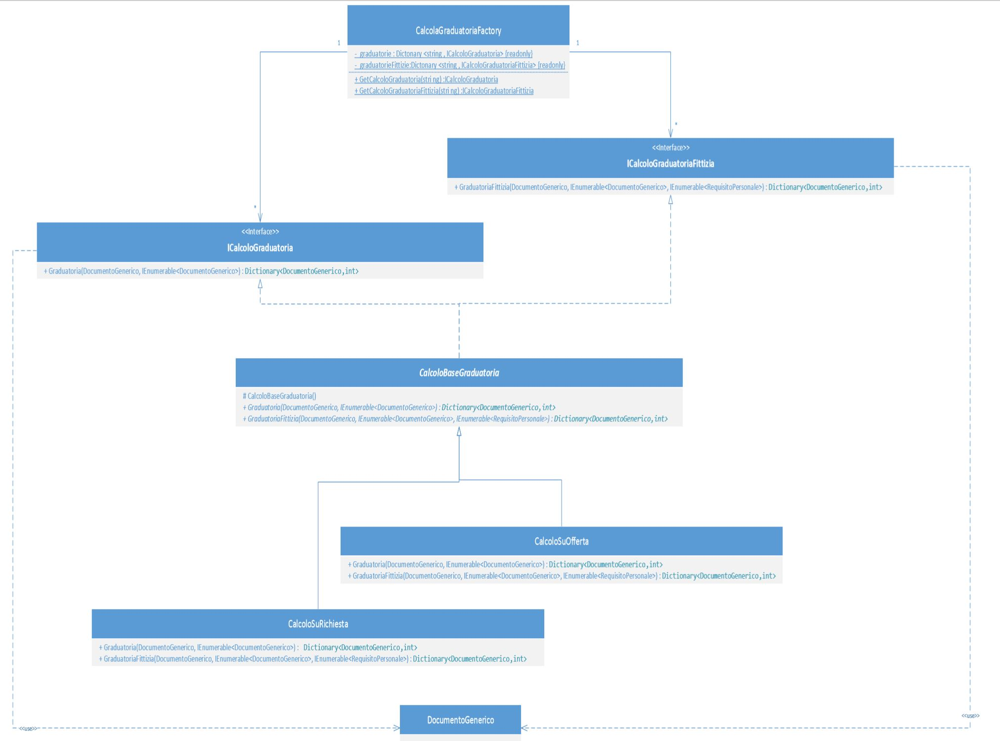
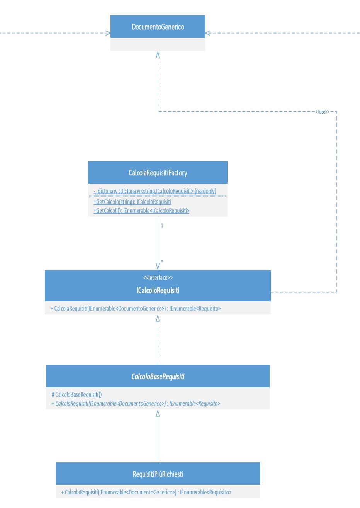

# work-search-system
Development of an application using typical pattern and design principles of OO languages (c# in this case). The system supports job seekers and employers by providing them with the analysis carried out by the software. For the unemployed, it is possible to obtain information about the most required skills to improve their chance to get a job. The Application design has been realized, after the customer requirements analysis, using UML diagrams.

